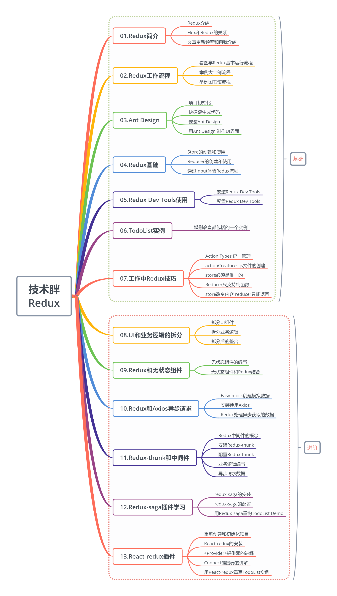
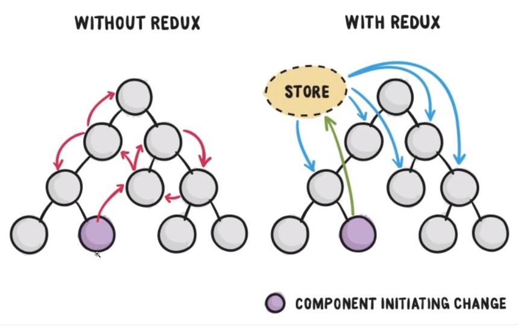
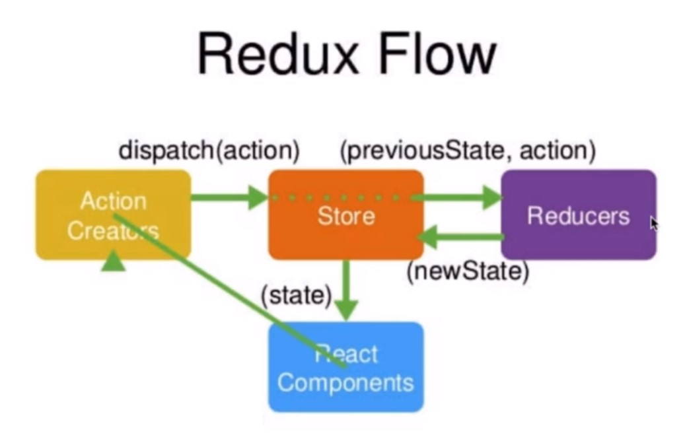
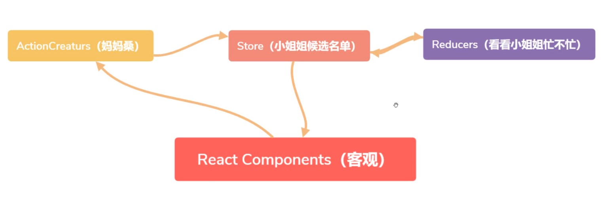

# v1.0 认识redux和文章前言
> React当中的组件通信和状态管理是特别繁琐的，比如子组件和父组件通信改变值，要通过父组件的方法。这就好比恋爱，要先认识女孩，再牵手，再接吻，最后你才能为所欲为。这种形式肯定不符合现在人的习惯，所以就有了很多快餐服务，通宵服务，极大的方便了现代人的需求。在开发中同样，公司最讲的就是效率，效率就需要把事情变简单，那只有React肯定不符合大型项目和快速开发。需要视图层框架+数据层框架，两个相互结合，就可以实现大型的开发项目了。

<font color="red">Redux</font>是目前React生态中，最好的数据层框架，所以单独拿出一个文章来系统的讲解Redux。

* 这里先给出这个课程的基本大纲，也是你可以学会的知识:


# v2.0 认识redux和文章介绍：

## Redux介绍：

> Redux是一个用来管理管理数据状态和UI状态的JavaScript应用工具。随着JavaScript单页应用（SPA）开发日趋复杂，JavaScript需要管理比任何时候都要多的state（状态），Redux就是降低管理难度的。（Redux支持React，Angular、jQuery甚至纯JavaScript）

可以通过一张图，看出Redux如何简化状态管理的（图片来自“前端记录”网站，如有侵权，请联系删除:

从图中可以看出，如果不用Redux，我们要传递state是非常麻烦的。Redux中，可以把数据先放在数据仓库（store-公用状态存储空间）中，这里可以统一管理状态，然后哪个组件用到了，就去stroe中查找状态。如果途中的紫色组件想改变状态时，只需要改变store中的状态，然后其他组件就会跟着中的自动进行改变。

## Flux和Redux的关系：
有很多小伙伴都会问我讲不讲Flux？这里我可以明确的回答你，不讲。

因为在我看来Redux就是Flux的升级版本，早期使用React都要配合Flux进行状态管理，但是在使用中，Flux显露了很多弊端，比如多状态管理的复杂和易错。所以Redux就诞生了，现在已经完全取代了Flux，过时的东西就不再讲解了。

如果你说公司还在用Flux，你可以试着学会Redux后，进行升级，抛弃Flux，其实前端的知识就是更新淘汰的这么迅速，要时刻保持学习的习惯。

# v3.0 Redux工作流程：
这节课要学习的知识非常重要，你只有学会了<font color="red">Redux</font>工作流程，你才能对<font color="red">Redux</font>有个通透的了解。如果你只官方的图或者自己看文档，还是有一点难度的。但是如果你红尘接触的多或者跟胖哥一样，是一个喜欢小姐姐的人，那这个流程就很简单了。（看视频）


## redux官方图片:
> 先来看一下官方给的图片，我也试着解说一下，不好勿怪。因为这东西本来就不太好了解，官方有很抽象。

这个的解读看视频吧，写起来还是挺麻烦的。其实我觉的这个图完全是个已经回Redux的人看的，至少是一个入门Redux的人看的，完全不符合一个初学者的视角。
## 我画的里截图:

我就以多年老司机的身份给你们讲解一下这个图，这个图你完全可以理解为一次大宝剑的过程，如果你经验不多，或者你是女孩子，我可以理解为借书的过程。当然我还是拿宝剑为例(图是我自己画的，很丑无怪).


* <font color="red">React Components</font>就相当于大官人，然后我们去作“大宝剑”，我们先见到的是<font color="red">Action Creators</font>“妈妈桑”,我们说我要找小红，我是熟客了。"妈妈桑"就回到了<font color="red">Store</font>，然后让<font color="red">Reducer</font>看看"小红“忙不忙（现在的状态），如果不忙就让她过来配大官人。


# v4.0 基础-<font color="red">Ant Design</font>介绍和环境初始化：

> Ant Design是一套面向企业级开发的UI框架，视觉和动效作的很好。阿里开源的一套UI框架，它不只支持React，还有ng和Vue的版本，我认为不论你的前端框架用什么，Ant Design都是一个不错的选择。习惯性把AntDesign简称为antd。 目前有将近5万Star，算是React UI框架中的老大了。

***初始化项目：***
这里我默认你已经看过我的“React16免费视频教程”了，所以我认为你这个过程已经了解了知识点，我只是带着你作一遍。
1. 如果你没有安装脚手架工具，你需要安装一下：
> npm install -g create-react-app

2. 直接用脚手架工具创建项目
```javascript
 D:  //进入D盘
 mkdir ReduxDemo   //创建ReduxDemo文件夹
 cd ReduxDemo      //进入文件夹
 create-react-app demo01  //用脚手架创建React项目
 cd demo01   //等项目创建完成后，进入项目目录
 npm  start  //预览项目
```

***快速生成基本代码结构:***
编写<font color="red">index.js</font>文件,这个文件就是一个基础文件，基本代码也都是一样的。
```javascript
import React from 'react';
import ReactDOM from 'react-dom'
import TodoList from './TodoList'

ReactDOM.render(<TodoList/>,document.getElementById('root'))
```
编写<font color="red">TodoList.js</font>文件,这个文件可以用<font color="red">Simple React Snippets</font>快速生成。 先输入<font color="red">imrc</font>,再输入<font color="red">ccc</font>
代码如下：
```javascript
import React, { Component } from 'react';
class TodoList extends Component {
    render() { 
        return ( 
            <div>Hello World</div>
         );
    }
}
export default TodoList;
```
做完这个，算是项目基本构建完成，可以打开浏览器看一下效果。接下来就可以安装<font color="red">Ant DesignUI</font>框架了。
***安装<font color="red">Ant DesignUI</font>：***
这里使用npm来进行安装，当然你有可以用yarn的方式进行安装.
> npm install antd --save

yarn的安装方式是:
>yarn add antd

如果你的网络情况不好，最好使用cnpm来进行安装。等待程序安装完以后，就可以进行使用了。这个我家里的网络安装起来非常耗时，所以就等待安装完成后，再下节课学习一下如何使用吧。


# v5.0 用Ant Desin制作UI界面

> 已经完成了基本开发环境和AntDesign的安装。这节课用Ant Design制作一下TodoList的界面。本文不会对Ant Design深入讲解，只是为了让课程的界面好看一点，如果你对它有强烈的学习需要或愿望，可以看一下Ant Design官方文档,文档都是中文，没有什么难度。图片就是这节课最后要做出的样式。

总结:这节课主要用Ant Design制作了todoList的界面，使用了、、\<Input>，\<Button>和\<List>组件，因为这个课程是讲Redux的，所以这些组件的使用方法并没有展开讲，主要是制作一个UI界面，为以后的课程作铺垫。如果你对Ant Design非常感兴趣，你可以去官方网站阅读文档。

# v6.0 创建Redux中的仓库-store和reducer:
> 这节开始，算是正式进入了Redux的编码阶段，你也要集中注意力进行学习了。开始编码前，你应该再熟悉一下以前讲的redux的工作流程。所以我也把图片放到了文字下方，方便你的预习。 从图片中可以看出，Redux工作流程中有四个部分，最重要的就是store这个部分，因为它把所有的数据都放到了store中进行管理。在编写代码的时候，因为重要，所以要优先编写store。

***编写创建store仓库：***
在使用Redux之前，需要先用npm install来进行安装,打开终端，并进入到项目目录，然后输入。（如果你之前安装过了，就不用再次安装了）
> npm install --save redux

安装好redux之后，在src目录下创建一个store文件夹,然后在文件夹下创建一个index.js文件。

index.js就是整个项目的store文件，打开文件，编写代码，接下去请看store/index.js开始学习。

# v7.0 Redux Dev Tools的安装:
> 上节课已经制作了Redux中state仓库，也可以从仓库中取出数据了。接下来我们需要在控制台调试这些仓库里的数据，需要使用Redux DevTools。安装这个是需要科学上网的，所以你需要先找一个好梯子。

***安装Redux DevTools:***

我使用Chrome浏览器安装插件，在浏览器右上角有三个点，然后点击"更多工具",再点击"扩展程序"，再点击右侧的"打开Chrome网上商店",然后搜索Redux DevTools，可以看到下面这个插件，直接安装就可以了。
安装完成后，你在控制台中就可以看到Redux标签了，有了这个标签也说明安装成功了。


***配置Redux DevTools:***

这也算是小伙伴经常问我的一个问题，就是如何配置这个<font color="red">Redux Dev Tools</font>插件，其实网站上已经说的非常清楚了，现在通过插件，打开这个网站。根据网站提示，我们把上节课的<font color="red">index.js</font>代码改为下面的样子。

```javascript
import { createStore } from 'redux' 
import reducer from './reducer'    
const store = createStore(reducer,
window.__REDUX_DEVTOOLS_EXTENSION__ && window.__REDUX_DEVTOOLS_EXTENSION__()) // 创建数据存储仓库
export default store  
```
其实就是加了这样一句话:
> window.__REDUX_DEVTOOLS_EXTENSION__ && window.__REDUX_DEVTOOLS_EXTENSION__()


* 这句话的意思就是看window里有没有这个方法，有则执行这个方法（不要被大写的方法名吓到）。

这步完成后，就可以启动项目测试一下了，你会发现State数据变的一目了然，以后再进行Redux调试，就会变的非常简单了。

# v8.0 通过Input体验Redux的流程:
> 这节课要作的就是通过Input的改变，体验一下Redux的整体流程，是如何编写代码的。我们要实现的是在TodoList的Demo中,只要文本框中的值改变就redux中store的值就跟着改变，并且随着Redux中的state值改变，组件也跟着改变。整个流程就是以前讲过的这个图，
# v9.0 Redux制作TodoList列表：
> 通过上节课的知识，我们用同样的方法和流程，再开发一遍toDoList里边的列表功能，具体来说就是当点击添加按钮时，ToDoList组件的列表会增加。知识其实我们都已经会了，缺少的是熟练度。
# v10.0 Redux制作TodoLists的删除功能：
> 这节再来走一遍Redux的流程，用Redux来制作一下删除功能。其实就是在点击ToDoList中的列表子项时，删除对应的子项。如果你觉的对Redux的流程已经掌握，可以停下看文章或者视频，自己先尝试着作一遍，然后再来进行对比。

# v11.0 工作中写Redux的小技巧-1：
> 上面的ToDoList Demo如果已经能熟练掌握了，说明你Redux已经入门了，可以先奖励自己一下了。但是你可能是一个已经走上工作岗位的老手，那你这样写Redux就稍微有点lowe了，你需要作合理的分离让层次更清晰。这节课和下节课我们来讲两个Redux实际开发中的小技巧

新建stroe/actionType.js文件，接下来请去那个文件中学习去！

# v11.0 工作中写Redux的小技巧-2：

>  目前ToDoList组件里有很多Action，并且分散才程序的各个地方，如果庞大的工程，这势必会造成严重的混乱，那这节课就把所有的Redux Action放到一个文件里进行管理。

在/src/store文件夹下面，建立一个心的文件actionCreators.js.

# v12.0 Redux中常遇的三个小坑：
>到这里Redux基础部分也就快结束了，但是我有必要再拿出一节课，把平时你容易犯的错误总结一下。这节课的知识点你可能都已经知道，也可以省略不看。我总结了三个React新手最容易范的错误。

* store必须是唯一的，多个store是坚决不允许，只能有一个store空间
* 只有store能改变自己的内容，Reducer不能改变
* Reducer必须是纯函数

    * 先来看什么是纯函数，纯函数定义：
    > 如果函数的调用参数相同，则永远返回相同的结果。它不依赖于程序执行期间函数外部任何状态或数据的变化，必须只依赖于其输入参数
    
    所以如下：
    ```javascript
    export default (state = defaultState,action)=>{
    if(action.type === CHANGE_INPUT){
        let newState = JSON.parse(JSON.stringify(state)) 
        newState.inputValue = action.value  

        <!-- 如果上面的这句改成  newState.inputValue = new Date()，这样就报错了，因为它就不是一个纯函数了（纯函数必须有传递进来的参数来决定的，而这里的new Date()每个时间的值都不一样，所以不是纯函数） -->

        return newState
    }
     return state
    }
    ```
# v13.0 组件UI和业务逻辑的拆分：
> Redux的基础知识都学完了，但是你离高手还差一点东西，就是如何拆分UI部分和业务逻辑，让项目更容易维护。你可能会问了除了更容易维护，还有没有其它好处，肯定是有的。能拆分了，就代表能更多人协作，实现超大型项目的开发和快速上线。比如两个人同时写一个模块，一个写UI部分，一个写业务逻辑部分，之后两个人在一起整合。也许小公司你觉的这样的优势不明显，因为公司的财力或者开发人员不足，使得这种开发方法大大受到了限制。但是大公司，不缺钱，不缺人，抢的就是时间，这时候这种开发模式就可以解决问题。这也是我为什么强烈推荐你去大公司的原因，虽然技术都一样，但是大公司和小公司开发的模式是完全不一样的。


新建src/TodoListUI.js文件

# v14.0 填坑和Redux中的无状态组件：

>上节课程序写完，有一个小错误，当时我并没注意到，还是VIP群里的小伙伴告诉我的，无意中给大家留了一个坑，跟大家说对不起了。这节课我们先解决这个遗留问题，再讲一下无状态组件：

无状态组件其实就是一个函数，它不用再继承任何的类（class），当然如名字所一样，也不存在state（状态）。因为无状态组件其实就是一个函数（方法）,所以它的性能也比普通的React组件要好。

***1. 填坑：***
> 上节课写完UI和业务分离后，在删除TodoList的项目时，是有一个错误的，这个错误属于业务逻辑错误，并不是语法错误。就是在删除item时，正序删除是没有问题的，但是倒叙删除是有问题的。 主要是我们的index出现了重新声明的问题。

原来的错误代码是这样的：
```javascript
<List
    bordered
    dataSource={this.props.list}
    renderItem={(item,index)=>(<List.Item onClick={(index)=>{this.props.deleteItem(index)}}>{item}</List.Item>)}
/>   
```
只要改成下面这样就正确了。
```javascript
 <List
    bordered
    dataSource={this.props.list}
    renderItem={
        (item,index)=>(
            <List.Item onClick={()=>{this.props.deleteItem(index)}}>
                {item}
            </List.Item>
        )
    }
/>    
```

***2. 无状态组件的改写：***

把UI组件改成无状态组件可以提高程序性能，具体来看一下如何编写。

1. 首先我们不在需要引入React中的{ Component }，删除就好。
2. 然后些一个TodoListUI函数,里边只返回JSX的部分就好，这步可以复制。
3. 函数传递一个props参数，之后修改里边的所有props，去掉this

这里给出最后修改好以后的无状态组件代码，这样的效率要高于以前写的普通react组件。

看TodoListUI.js这个文件（这个文件只有UI，没有页面逻辑这些，改成无状态组件的形式是最好的了）

# v15.0 Axios异步获取数据并和redux合并：
> 这节课是最近几天小伙伴问我比较多的问题，就是从后端接口获取了数据，如何可以放到Redux的store中，很多小伙伴被这个困难卡住了。这节课就来学习一下如何从后台取得数据，并和Redux结合，实现想要的业务逻辑。比如以前我们的列表数据是在Reducer里写死的，这节课使用Axios从后台获取数据。

***1. 利用easy-mock创建模拟数据:***
这个在基础课程中已经讲过了，我就不作过多的介绍了，如果你还不会，就直接看基础课程吧，反复讲也没什么意思。如果你说我也懒得新建一个，你也可以使用我的模拟数据，我在这里给出地址。
> 地址：https://www.easy-mock.com/mock/5cfcce489dc7c36bd6da2c99/xiaojiejie/getList

JSON的基本格式，如果上面的接口不管用了，你可以用Easy mock自己作一个这样的接口:
```javascript
{
  "data": {
    "list": [
      '早上4点起床，锻炼身体',
      '中午下班游泳一小时',
      '晚上8点到10点，学习两个小时'
    ]
  }
}
```
***2. 安装并使用axios:***
因为在Redux的学习中，我们使用了新的项目和目录，所以要重新安装Axios插件（以前安装的不能再使用了）。直接使用npm进行安装。
> npm install --save axios

安装完成后，就可以在TodoList.js中，引入并进行使用了。
> import axios from 'axios'

引入后，在组件的声明周期函数里componentDidMount获取远程接口数据。
```javascript
componentDidMount(){
    axios.get('https://www.easy-mock.com/mock/5cfcce489dc7c36bd6da2c99/xiaojiejie/getList').then((res)=>{
        console.log(res)
    })
}
```
做完这一步骤后，可以在浏览器中打开，预览下是否控制台(console)获取数据，如果可以获取，说明完全正常。
***3. 获取数据后跟Redux相结合（重点）***

# v16.0 Redux-thunk中间件的安装和配置：

通过学习，你已经对Redux的基本流程有了全面的了解，也许你已经在项目中开始使用。其实咱们一起学完了大部分的Redux知识，但是我还是决定继续讲解一下Redux-thunk这个Redux最常用的插件。
> 什么时候会用到这个插件那？比如在Dispatch一个Action之后，到达reducer之前，进行一些额外的操作，就需要用到middleware（中间件）。在实际工作中你可以使用中间件来进行日志记录、创建崩溃报告，调用异步接口或者路由。 这个中间件可以使用是Redux-thunk来进行增强(当然你也可以使用其它的)，它就是对Redux中dispatch的加强，这节课我们先来学习一下安装和配置（特别是配置的使用很多小伙伴都配置不成功）。

***1. 安装redux-thunk组件：***
Redux-thunk并不在Redux基础组件中，也就是说需要进行新安装。安装使用npm就可以了。
> npm install --save redux-thunk

***2. 配置redux-thunk组件：***

> 安装作起来很容易，但是配置就要稍微注意一下了，这里边还是有几个小坑的，如果你完全按照官方文档是配置不成功的。 需要在创建store的地方引入redux-thunk，对于我们的目录来说，就是/store/index.js文件。

# v17.0 Redux-thunk的使用方法：
这节课我们把向后台请求数据的程序放到中间件中，这样就形成了一套完整的Redux流程，所有逻辑都是在Redux的内部完成的，这样看起来更完美，而且这样作自动化测试也会变动简单很多，所以工作中你还是要尽量按照这种写法来写。现在就开始学习吧。

看actionCreatores.js文件！为什么？（图标为以前actionCreators.js都是定义好的action，根本没办法写业务逻辑，有了Redux-thunk之后，可以把TodoList.js中的componentDidMount业务逻辑放到这里来编写（即：Redux-thunk生成的也是action。只是以前action返回的是一个{}对象，而现在我们有了Redux-thunk的机制，我们可以返回一个方法，也就是说它归根结底还是一个action，所以我们将代码放在actionCreatores.js文件中）。也就是把向后台请求数据的代码放到actionCreators.js文件里。）

# v18.0 Redux-saga的安装和配置：